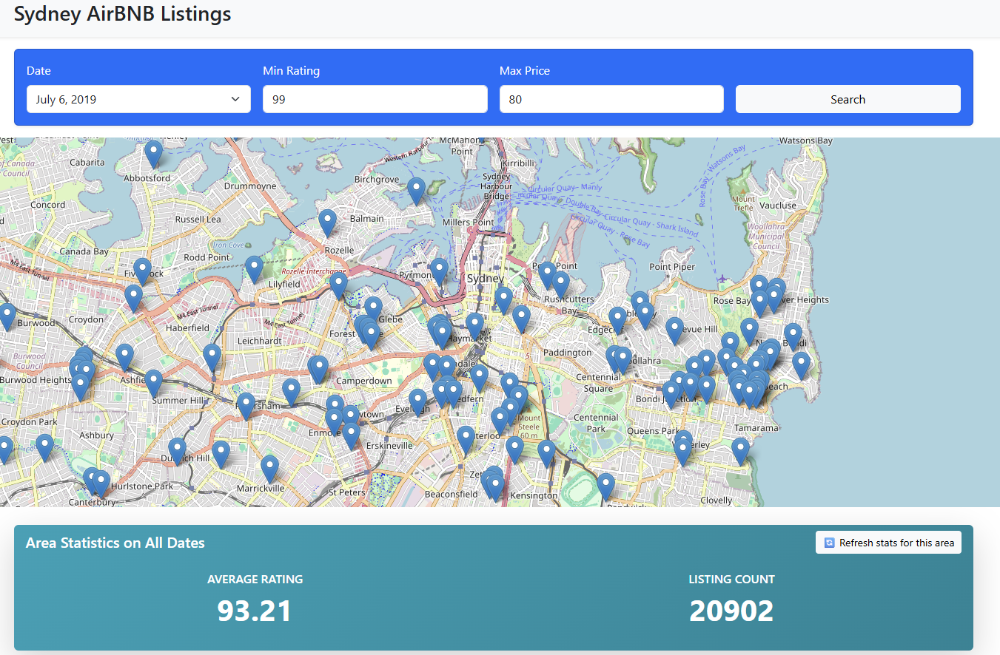
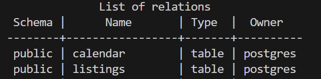
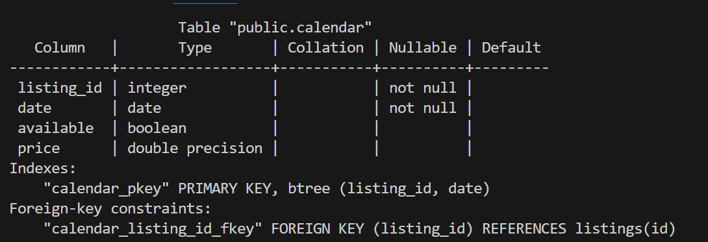
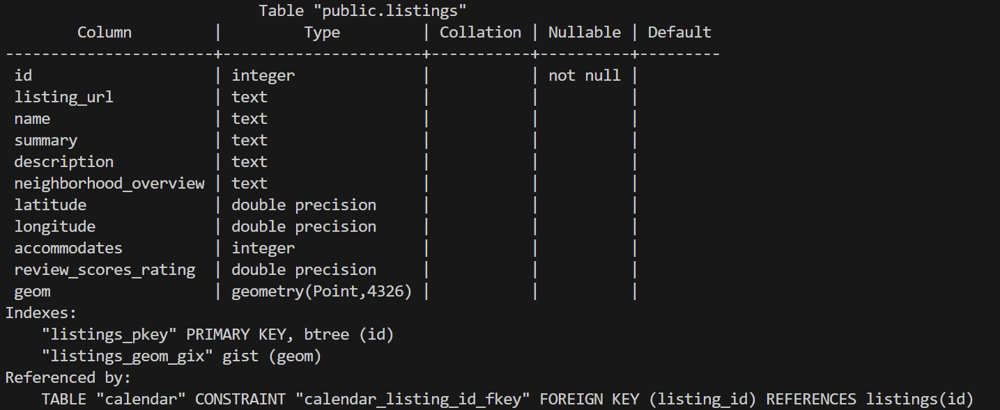

# AIRBNB_APPLICATION


## 1. Project Overview
### Motivation
- This web application helps users easily find available Airbnb-style listings directly on a map, without needing to search by city name.

- For example, a traveler can simply zoom in on Sydney, Bondi Beach, or any region, and instantly discover listings available on a specific date, within a budget, and above a certain rating.

- It’s especially helpful when users don’t know the exact name of the neighborhood or want to explore areas by location rather than text search.

- In addition, the app improves on the traditional Airbnb experience by:

  - Letting users find the closest better-rated listings, so they don’t miss higher-quality options nearby.

  - Showing live statistics (like average rating and listing density) based on the area currently visible on the map .

### Web Application Functions
- Map-based Listing Search:

  - Search for available listings in any rectangular area on the map.

  - Filter results by date, price range, and minimum rating.

- Better Nearby Listings:

  - Click on any listing to find the nearest available listing with a higher rating — perfect for upgrading your stay.

- Dynamic Area Statistics:

  - See average rating and listing count for the region you're viewing — helpful for comparing neighborhoods.

---

## 2. Technology Stack
### Programming Languages & Frameworks
- Backend: 
  - Flask (Python) — for handling routes, rendering templates, and building REST endpoints.
  - PostgreSQL + PostGIS — used to store and query geographic listing data efficiently (spatial filtering, proximity, bounding box queries).

- Frontend: 
  - HTML5 and Bootstrap for a modern, responsive UI layout that adapts to any screen size.
  - Leaflet.js for the interactive, plug-and-play map view.
  - JavaScript to control map behavior, manage user interactions, and dynamically update content.
  - Fetch API to perform real-time REST calls to the backend in js.
- Database:  PostgreSQL with PostGIS

### Packages & Dependencies
  - Psycopg2 — PostgreSQL adapter for Python, used to execute queries securely and manage connections.
  - dotenv — for managing environment variables like database credentials securely.

---

## 3. Setup Instructions
### Environment Setup
For example,
```bash
# Install required dependencies
python -m venv venv
venv\Scripts\activate #for windows CMD
# 3. Install Python dependencies
pip install -r requirements.txt
```

### Database Configuration
- **Database Schema**: 




- **How to get The data**:

Download from https://www.kaggle.com/datasets/tylerx/sydney-airbnb-open-data
only download calendar_dec18.csv and listings_dec18
Convert to UTF-8 with a online converter (https://www.virtualbadge.io/resources/utf-8-converter-for-csv-files) , even tho it is supposed to be UTF-8 , I had some issues if i did not.

!!! Place them in a directory (make yourself) called data. And rename them to calendar.csv and listings.csv (otherwise you have to change this in clean_data.py)

Now run the clean_data.py script to clean your data, this removes "$" and null value from the price field, and some other cleaning. The outputs are stored in tablename_cleaned_subset.csv.

Now you should be set for the next step!


- **How to Initialize Database**:


create a database in your postgres and connect to it

  ```bash
  psql -U your_username -d your_database

  ```
Edit the init_airbnb.sql on line 37, 39, to point to the cleaned csv files (you can do this by copying the path to the csv and replacing it in the line)

The next script will create the tables, and load the data and create indexes.

  ```bash
  \i path/to/init_airbnb.sql
  ```
- **Database Connection**
- In the root of the directory make an .env file with thhe following fields, and fill them in according to the database you created:
  ```bash
    DB_HOST=localhost
    DB_USER=postgres
    DB_PASSWORD=111111
    DB_NAME=my_spatial_db
    DB_PORT=5432
  ```


## 4. Code Structure
### Frontend
- The HTML paged gets rendered and is located at /templates/home.html
- The javascript file that is used is located in /static/js/map.js

The frontend is built with HTML5 and Bootstrap for a sleek, responsive design that works well across devices. The interactive map is powered by Leaflet.js, a lightweight open-source JavaScript library that makes it easy to embed and control maps. Custom JavaScript is used to handle user interactions (like panning, zooming, and clicking) and to perform REST API calls to dynamically load and display available listings based on the current map view and selected filters.

In map.js:
- `searchAndPlotListings` fetches and displays Airbnb listings within the visible map area based on user-selected filters.  
- `highlightNearestHigher` finds and highlights the nearest listing with a higher rating than the selected one.  
- `fetchStats` retrieves and displays average rating and total listing count for the current map view.


### Backend
- Location of backend code: app.py
- **GET `/api/search_rectangle`**  
  Returns Airbnb listings available within a given bounding box, filtered by date, minimum rating, and maximum price.

- **GET `/api/nearest_higher/<ref_id>`**  
  Finds and returns the nearest listing that has a higher rating than the listing with the specified ID.

- **GET `/api/stats`**  
  Returns summary statistics (average rating and listing count) for listings within the current map bounds.


---

## 5. Queries Implemented
### Query 1: Search Listings Within a Rectangle
This query finds all listings that fall within a rectangular bounding box (based on the current zoom level in Leaflet), are available on a specific date, and match user-specified filters for minimum rating and maximum price.
Real-world application: Users can visually explore available Airbnb listings on a map and filter based on price and rating in their desired area of Sydney.

### Query 1: (SQL Query)
```sql
SELECT DISTINCT l.*
FROM listings l
JOIN calendar c ON l.id = c.listing_id
WHERE 
    l.geom && ST_MakeEnvelope(%s, %s, %s, %s, 4326)
    AND c.date = %s
    AND c.available = TRUE
    AND l.review_scores_rating >= %s
    AND c.price <= %s;
```
source: https://gis.stackexchange.com/questions/83387/performing-bounding-box-query-in-postgis 
%s: Placeholders for query parameters, passed from the Flask backend.
ST_MakeEnvelope(min_lng, min_lat, max_lng, max_lat, 4326): Creates a bounding box for spatial filtering.

c.date = %s: Filters availability for one specific day.

c.available = TRUE: Ensures the listing is not booked.

review_scores_rating >= %s: Filters for listings with sufficient quality.

c.price <= %s: Filters for listings within budget.

### Query 1: Unexpected Value Handling
Input types are validated and converted (e.g., float for coordinates, date for c.date).

If any parameter is missing, Flask returns a 400 error with a helpful message.

If no results match, the frontend receives an empty list.
The rating must be between 0 and 100.
Values are allways injected with cursor, to prevent SQL injection Attacks.


### Query 2: Find Closest Available Listings to a Selected One
Given a listing ID, this query returns the NEAREST NEIGHBOURING listing with a higher rating. (it neglects availability)
Real-world application: If a user's preferred listing is not ideal, the app can suggest alternatives nearby with better quality.

### Query 2: (SQL Query)
```sql
SELECT
    id,
    listing_url,
    name,
    latitude,
    longitude,
    review_scores_rating,
    ST_Distance(%s::geography, geom::geography) AS distance_meters
FROM listings
WHERE
    id <> %s
    AND review_scores_rating > %s
ORDER BY
    geom <-> %s
LIMIT 1
```
l1.id = %s: The reference listing.
 %s : the second is the geom

 !NOTE: we have obtained this from a previous query , to check if even that listing exist --> prevent unneccesary joins.

ST_Distance(...): Computes geospatial distance between listings.

### Query 2: Unexpected Value Handling
Ensures that the reference_listing_id exists before querying.

Returns a 404-style message if the listing doesn’t exist or no matches are found.

Values are allways injected with cursor, to prevent SQL injection Attacks.

### Query 3: Average Price and Rating Per Neighborhood
This query calculates average review rating, and number of listings within a user-defined bounding box .
Allows users to compare different areas of a city  based on quality — useful for heatmaps or neighborhood-level analysis.

### Query 3: (SQL Query)
```sql
SELECT 
    ROUND(AVG(c.price)::numeric, 2) AS avg_price,
    ROUND(AVG(l.review_scores_rating)::numeric, 2) AS avg_rating,
    COUNT(*) AS listing_count
FROM listings l
WHERE 
    l.geom && ST_MakeEnvelope(%s, %s, %s, %s, 4326)
```
%s: Parameters from frontend — min_longitude, min_latitude, max_longitude, max_latitude,

ST_MakeEnvelope(...): Filters listings to only those within the visible map area.

AVG, COUNT: Used to generate aggregate statistics.

ROUND: Rounds numeric output for cleaner presentation

### Query 3: Unexpected Value Handling
Returns null for averages if no listings are found.

Backend checks coordinate formats

Empty result or 0 count is handled gracefully in the frontend.

Values are allways injected with cursor, to prevent SQL injection Attacks.


## 6. How to Run the Application
In root just run:
```bash
    python app.py
  ```


## 7. Port Usage
- PORT 5000

## 8. UI Address
E.g., [https:\\localhost:5000](http://127.0.0.1:5000)

## 9. Additional Notes
- I acknowledge using ChatGPT for generating HTML code to generate my UI, I also used it to troubleshoot errors in my javascript and python file . Finally, I used it to help me write the documentation and report to prevent spelling mistakes.
